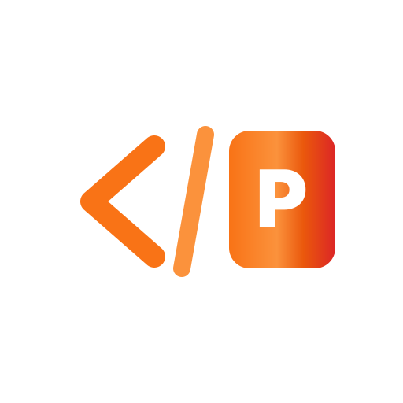

<div align="center">
  
  <h1>HTML to PPTX Converter</h1>
  <p><strong>High-Performance HTML Presentation to 4K PowerPoint Engine for macOS</strong></p>
  <p align="center">
  Made for  <strong>macOS</strong> (Apple Silicon & Intel)
  </p>

  <p>
    
    
    
    
    
  </p>

  <p><em>Turn beautiful HTML/CSS slide decks into crisp, pixel-perfect PowerPoint presentations in seconds.</em></p>
</div>

---

**HTML to PPTX Converter** is a free, native macOS application designed to convert modern web presentations (HTML/CSS/JS slide decks) into ultra-high-resolution **4K 16:9 PowerPoint (.pptx)** files with zero layout distortion, zero font clipping, and zero cloud uploads.

Built for engineers, designers, and teams who create HTML presentations and need professional PowerPoint decks ready for sharing, offline presenting, and client delivery.

---

## ⚡ Why HTML to PPTX Converter?

| Feature | HTML to PPTX Converter | Online / Cloud Converters | Manual Screenshots |
| :--- | :--- | :--- | :--- |
| **Privacy** | 🔒 **100% On-Device** (zero data leaves your Mac) | ☁️ Uploads entire decks to third-party servers | 🔒 On-device |
| **Resolution** | 📺 **Ultra 4K Retina (2.5x device scale)** | ⚠️ Often blurry 720p or 1080p | ⚠️ Depends on screen size |
| **Speed** | ⚡ **Parallel Multi-Core Engine** (up to 3 decks at once) | ⏳ Queues & slow cloud jobs | 🐌 Tedious & time-consuming |
| **Batch Folder** | 📂 **Drop a folder** → converts every HTML inside | ⚠️ Single file only | ⚠️ Manual per-slide effort |
| **Animations** | 🎨 **Smart CSS Settle** (expands all `.fade-up` / `.reveal` elements) | ❌ Captures blank or mid-transition slides | ⚠️ Must trigger manually |
| **Cost** | 🆓 **Free & Open Source** | 💰 Subscriptions / Watermarks | 🆓 Free (costs your time) |

---

## ✨ Key Features

*   **100% On-Device & Private**: 🔒 Your presentations and proprietary content **never leave your machine**. No cloud servers, no telemetry, no tracking, and no external dependencies.
*   **Ultra 4K Retina Rendering**: 🖼️ Powered by headless Chrome capturing slides at 2.5x device scale factor (equivalent to 4000×2250 resolution) for razor-sharp text, crisp gradients, and vivid charts.
*   **Adaptive Apple Silicon Concurrency**: 🧠 Inspects CPU core count, available RAM, and thermal state to dynamically run up to 3 parallel conversion engines without slowing down your Mac.
*   **Batch Folder & Multi-File Drag-and-Drop**: 📂 Drag an entire presentation folder (or multiple `.html` files) into the app window. It will discover all slide decks and convert them simultaneously.
*   **Exact 1-to-1 Naming**: 🏷️ Automatically maps `index.html` ➔ `index.pptx` and `Master_Presentation_Detailed.html` ➔ `Master_Presentation_Detailed.pptx` directly inside the source folder.
*   **Smart CSS Animation Stabilization**: ✨ Forces all `.fade-up`, `.reveal`, and delayed animations to full opacity and settles layout transitions before taking screenshots.
*   **Live Multi-Worker Progress**: 📊 Tracks conversion progress across all files with live 4K slide counters and elapsed timers.
*   **Native macOS Integration**: 🍎 Designed with a native SwiftUI interface, frosted glass aesthetics, keyboard shortcut (`⌘O`), native `UNUserNotificationCenter` completion alerts with brand artwork, and one-click **"Reveal in Finder"**.
*   **Built-in Update Checker**: 🔄 Check for the latest releases directly from the Info `(i)` menu.

---

## 📦 One-Command Install

The fastest way to install **HTML to PPTX Converter** is to run the following one-liner in your **Terminal**:

```bash
/bin/bash -c "$(curl -fsSL https://raw.githubusercontent.com/arunofhyd/HTML2PPTX/main/install-html2pptx.command)"
```

### Manual Installation (Fallback)

If you prefer to download and run the installer script manually:

1. **Download** [`install-html2pptx.command`](install-html2pptx.command) (open the file, then click **Download raw file**).
2. Open **Terminal** (`⌘ + Space`, type `Terminal`, press Enter).
3. Type `sh ` — that's **s**, **h**, then a **space**.
4. **Drag** the downloaded `install-html2pptx.command` into the Terminal window.
5. Press **Enter**, follow the prompts, and click **Instant Install** (or drag to Applications).

> **First time only:** The installer will verify that Apple's Command Line Tools (`xcode-select`) and Python libraries are ready. Because the app is compiled directly on your Mac, macOS Gatekeeper trusts it natively without security warnings.

---

## ⚙️ How It Works

1. **Native SwiftUI Frontend**: Provides a lightweight, responsive drag-and-drop workspace with hardware-aware scheduling.
2. **Headless Chrome Puppeteer Engine**: Launches isolated browser instances that load your local HTML files, strips navigation chrome, expands presentation sections, and renders 4K snapshots.
3. **PowerPoint Assembly Engine**: Takes the captured 4K images and packages them into standard widescreen 16:9 `.pptx` presentations using native slide layouts.

---

## 🗑️ Uninstall

1. Quit **HTML to PPTX Converter**.
2. Drag **HTML to PPTX Converter.app** from `/Applications` to the Trash.

---

## 📦 Tech Stack

*   **Swift 6 / SwiftUI** (Native macOS Application)
*   **Python 3 & python-pptx** (Presentation packaging)
*   **Puppeteer / Chrome Headless Shell** (4K slide capture)
*   **AppKit & UserNotifications** (macOS System Integration)

---

## 📄 License

MIT License. Free and open source.

---

<p align="center">
  Made with ❤️ by <a href="mailto:arunthomas04042001@gmail.com">Arun Thomas</a> · <a href="https://github.com/arunofhyd/HTML2PPTX">GitHub</a>
</p>
